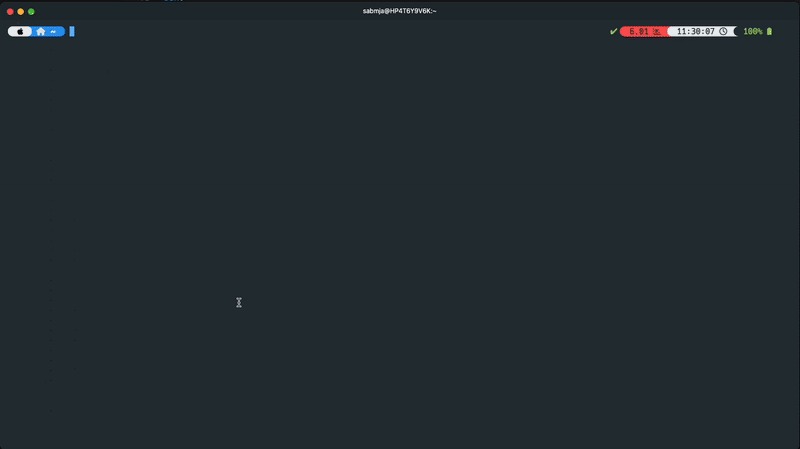

**Multiplex your SSH connections with style**

SSHplex is a Python-based SSH connection multiplexer that provides a modern Terminal User Interface (TUI) for selecting and connecting to multiple hosts simultaneously using tmux. It integrates with multiple Sources of Truth (NetBox, Ansible, Consul, static lists) and creates organized tmux sessions for efficient multi-host management.

## Features

- **Interactive TUI**: Modern host selector built with Textual - search, sort, select, connect
- **Multiple Sources of Truth**: NetBox, Ansible inventories, HashiCorp Consul, and static host lists - use them together or separately
- **Multi-Provider Support**: Configure multiple instances of the same provider type (e.g., multiple NetBox instances, multiple Consul datacenters)
- **tmux Integration**: Creates organized sessions with panes or windows for each host
- **iTerm2 Integration**: Native tmux `-CC` mode on macOS for iTerm2 tabs/splits
- **Proxy Support**: Per-provider SSH proxy/jump host configuration
- **Wildcard Search**: Filter hosts across all columns with glob patterns
- **Sortable Columns**: Click column headers to sort the host table
- **Copy to Clipboard**: Copy the host table to clipboard for sharing
- **Intelligent Caching**: Local host caching for fast startup (configurable TTL)
- **Broadcasting**: Sync input across multiple SSH connections
- **Session Manager**: Browse, connect to, or kill existing tmux sessions from the TUI
- **SSH Security**: Configurable host key checking with secure defaults
- **Connection Retry**: Automatic retry with exponential backoff for reliability
- **Enhanced CLI**: Debug mode, cache management, and configuration utilities

## Prerequisites

- **Python 3.8+**
- **tmux**
- **SSH key** configured for target hosts
- **macOS or Linux** (Windows via WSL)

```bash
# macOS
brew install tmux python3

# Ubuntu/Debian
sudo apt install tmux python3 python3-pip

# RHEL/CentOS/Fedora
sudo dnf install tmux python3 python3-pip
```

## Installation

### From PyPI

```bash
pip install sshplex

# With Consul support
pip install "sshplex[consul]"
```

### From Source

```bash
git clone https://github.com/sabrimjd/sshplex.git
cd sshplex
pip install -e .

# With Consul support
pip install -e ".[consul]"

# With dev dependencies
pip install -e ".[dev]"
```

## Quick Start

```bash
# Launch TUI (creates default config on first run)
sshplex

# Debug mode - test provider connectivity
sshplex --debug

# Show configuration paths
sshplex --show-config

# Clear host cache
sshplex --clear-cache
```

On first run, SSHplex creates a config at `~/.config/sshplex/sshplex.yaml`. Edit it with your provider details, then run `sshplex` again.

## Usage

1. **Start**: Run `sshplex`
2. **Browse**: Hosts from all configured providers appear in the table
3. **Search**: Press `/` to filter hosts (supports wildcards)
4. **Select**: `Space` to toggle, `a` to select all, `d` to deselect all
5. **Configure**: `p` to toggle panes/tabs, `b` to toggle broadcast
6. **Connect**: `Enter` to create tmux session and connect
7. **Sessions**: `s` to manage existing tmux sessions
8. **Copy**: `c` to copy the host table to clipboard
9. **Refresh**: `r` to refresh hosts from providers (bypasses cache)

### TUI Keybindings

| Key | Action |
|-----|--------|
| `Space` | Toggle host selection |
| `a` | Select all hosts |
| `d` | Deselect all hosts |
| `Enter` | Connect to selected hosts |
| `/` | Search/filter hosts |
| `p` | Toggle panes/tabs mode |
| `b` | Toggle broadcast mode |
| `s` | Open session manager |
| `c` | Copy table to clipboard |
| `r` | Refresh from providers |
| `Escape` | Focus table / clear search |
| `q` | Quit |

### tmux Commands (once attached)

```bash
Ctrl+b + Arrow Keys    # Switch between panes
Ctrl+b + n/p           # Next/Previous window
Ctrl+b + b             # Toggle broadcast (custom SSHplex binding)
Ctrl+b + d             # Detach from session
Ctrl+b + z             # Zoom/unzoom current pane
```

## CLI Reference

```bash
sshplex                        # Launch TUI
sshplex --debug                # Test provider connectivity
sshplex --clear-cache          # Clear host cache
sshplex --show-config          # Show configuration paths
sshplex --config /path/to.yml  # Use custom config file
sshplex --verbose              # Enable verbose logging
sshplex --version              # Show version
```

## Configuration

Configuration is stored at `~/.config/sshplex/sshplex.yaml`. See [config-template.yaml](sshplex/config-template.yaml) for a full example.

### Static Hosts

```yaml
sot:
  import:
    - name: "my-servers"
      type: static
      hosts:
        - name: "web-01"
          ip: "192.168.1.10"
          description: "Web server"
          tags: ["web", "production"]
        - name: "db-01"
          ip: "192.168.1.20"
          description: "Database server"
          tags: ["database", "production"]
```

### NetBox

```yaml
sot:
  import:
    - name: "prod-netbox"
      type: netbox
      url: "https://netbox.example.com/"
      token: "your-api-token"
      verify_ssl: true
      timeout: 30
      default_filters:
        status: "active"
        role: "virtual-machine"
        has_primary_ip: "true"
```

### Ansible Inventory

```yaml
sot:
  import:
    - name: "production-hosts"
      type: ansible
      inventory_paths:
        - "/path/to/inventory.yml"
      default_filters:
        groups: ["webservers", "databases"]
        exclude_groups: ["maintenance"]
        host_patterns: ["^prod-.*"]
```

### Consul

Requires `pip install "sshplex[consul]"`.

```yaml
sot:
  import:
    - name: "consul-dc1"
      type: consul
      config:
        host: "consul.example.com"
        port: 443
        token: "your-consul-token"
        scheme: "https"
        verify: false
        dc: "dc1"
        cert: ""  # Optional SSL cert path
```

### SSH Proxy / Jump Host

Configure per-provider proxy routing:

```yaml
ssh:
  username: "admin"
  key_path: "~/.ssh/id_ed25519"
  port: 22
  proxy:
    - name: "prod-proxy"
      imports: ["consul-dc1", "prod-netbox"]  # Which providers use this proxy
      host: "jumphost.example.com"
      username: "admin"
      key_path: "~/.ssh/jump_key"
```

### SSH Security Options

Configure SSH host key checking and retry behavior:

```yaml
ssh:
  username: "admin"
  key_path: "~/.ssh/id_ed25519"
  # Security options
  strict_host_key_checking: false  # Options: true (strict), false (accept-new)
  user_known_hosts_file: ""  # Empty = default ~/.ssh/known_hosts
  # Connection retry
  retry:
    enabled: true
    max_attempts: 3
    delay_seconds: 2
    exponential_backoff: true  # Double delay on each retry
```

**Security Note**: By default, SSHplex uses `StrictHostKeyChecking=accept-new` which automatically accepts new host keys but warns on key changes. For production environments, set `strict_host_key_checking: true` for maximum security.

### iTerm2 Integration (macOS)

Enable native iTerm2 tmux integration with `-CC` mode:

```yaml
tmux:
  control_with_iterm2: true  # Opens new iTerm2 window with native tabs/splits
```

### Cache

```yaml
cache:
  enabled: true
  cache_dir: "~/.cache/sshplex"
  ttl_hours: 24  # Refresh daily
```

### UI

```yaml
ui:
  show_log_panel: false
  table_columns: ["name", "ip", "cluster", "role", "tags", "description", "provider"]
```

## Troubleshooting

### Debug Mode

```bash
sshplex --debug
```

Tests provider connectivity and lists all discovered hosts.

### Enable Logging

```yaml
logging:
  enabled: true
  level: "DEBUG"
  file: "logs/sshplex.log"
```

### Common Issues

| Issue | Solution |
|-------|----------|
| `tmux is not installed` | Install tmux: `brew install tmux` / `apt install tmux` |
| NetBox connection failed | Check URL, token, and network connectivity |
| Ansible inventory not loading | Verify file paths exist and YAML syntax is valid |
| No hosts found | Remove filters temporarily, check provider logs |
| Consul import error | Install with `pip install "sshplex[consul]"` |
| SSH key auth failed | Check key path and permissions (`chmod 600`) |

## Development

```bash
git clone https://github.com/sabrimjd/sshplex.git
cd sshplex
pip install -e ".[dev]"

# Run tests
python3 -m pytest tests/

# Local Consul for testing
docker-compose -f docker-compose.consul.yml up -d
```

## Contributing

SSHplex welcomes contributions! The codebase follows the KISS principle.

## License

MIT License - see [LICENSE](LICENSE) for details.

## Author

**Sabrimjd** - [@sabrimjd](https://github.com/sabrimjd)

## Acknowledgments

- [Textual](https://textual.textualize.io/) - Modern TUI framework
- [NetBox](https://netbox.dev/) - Infrastructure source of truth
- [HashiCorp Consul](https://www.consul.io/) - Service discovery
- [tmux](https://github.com/tmux/tmux) - Terminal multiplexing
- [loguru](https://github.com/Delgan/loguru) - Logging

---

**SSHplex** - Because managing multiple SSH connections should be simple and elegant.
