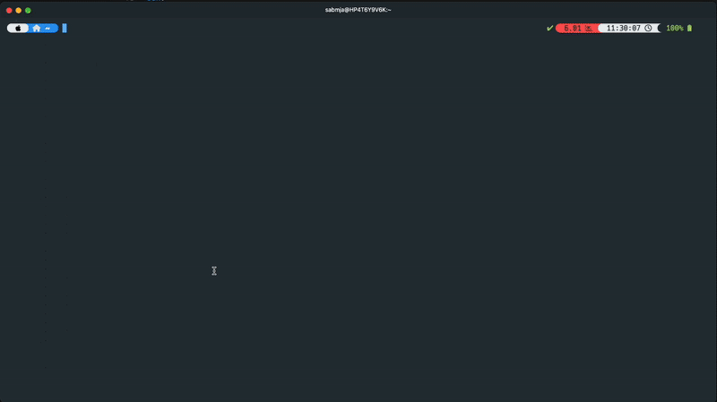

**Multiplex your SSH connections with style**

SSHplex is a Python-based SSH connection multiplexer with a modern TUI. Connect to multiple hosts simultaneously using tmux or iTerm2, with sources from NetBox, Ansible, Consul, or static lists.

## Features

- 🖥️ **Modern TUI** - Textual-based host selector with search, sort, and multi-select
- 🔌 **Multiple Sources** - NetBox, Ansible, Consul, static lists - use them together
- 📦 **3 Backends** - tmux standalone, tmux + iTerm2, or iTerm2 native (macOS)
- ✏️ **Config Editor** - Built-in YAML editor with validation (`e` key)
- 🔄 **Broadcast Input** - Sync commands across multiple SSH sessions
- 🔐 **SSH Security** - Configurable host key checking and retry logic
- 🚀 **Fast Startup** - Intelligent caching with configurable TTL

## Quick Start

```bash
# Install
pip install sshplex

# First-time setup (interactive wizard)
sshplex --onboarding

# Launch TUI
sshplex
```

### Prerequisites

- Python 3.8+
- tmux (Linux/macOS) or iTerm2 (macOS)
- SSH key configured for target hosts

## Usage

| Key | Action |
|-----|--------|
| `Space` | Toggle host selection |
| `a` / `d` | Select / Deselect all |
| `Enter` | Connect to selected hosts |
| `/` | Search/filter hosts |
| `p` | Toggle panes/tabs mode |
| `b` | Toggle broadcast mode |
| `e` | Open config editor |
| `s` | Open session manager |
| `h` | Show keyboard shortcuts |
| `q` | Quit |

## Multiplexer Backends

| Backend | Platform | Best For |
|---------|----------|----------|
| **tmux** | Linux, macOS | Maximum compatibility, persistence |
| **tmux + iTerm2** | macOS | Native UI + persistence |
| **iTerm2 native** | macOS | Simple setup, no tmux dependency |

```yaml
# ~/.config/sshplex/sshplex.yaml
tmux:
  backend: "tmux"  # or "iterm2-native" on macOS
  layout: "tiled"
  max_panes_per_window: 5
```

## Sources of Truth

### Static Hosts
```yaml
sot:
  import:
    - name: "my-servers"
      type: static
      hosts:
        - {name: "web-01", ip: "192.168.1.10", tags: ["web"]}
```

### NetBox
```yaml
sot:
  import:
    - name: "prod"
      type: netbox
      url: "https://netbox.example.com/"
      token: "your-api-token"
```

### Ansible
```yaml
sot:
  import:
    - name: "inventory"
      type: ansible
      inventory_paths: ["/path/to/inventory.yml"]
```

### Consul
```bash
pip install "sshplex[consul]"
```
```yaml
sot:
  import:
    - name: "dc1"
      type: consul
      config:
        host: "consul.example.com"
        token: "your-token"
```

## CLI Reference

```bash
sshplex                        # Launch TUI
sshplex --onboarding           # Interactive setup wizard
sshplex --debug                # Test provider connectivity
sshplex --show-config          # Show config paths
sshplex --clear-cache          # Clear host cache
sshplex --config /path/to.yml  # Use custom config
```

## Documentation

| Guide | Description |
|-------|-------------|
| [Configuration](docs/configuration.md) | Full config reference with examples |
| [Backends](docs/backends.md) | Multiplexer backend options and setup |
| [Troubleshooting](docs/troubleshooting.md) | Common issues and solutions |

## Installation Options

```bash
# Basic (tmux only)
pip install sshplex

# With Consul support
pip install "sshplex[consul]"

# With iTerm2 native support (macOS)
pip install "sshplex[iterm2]"

# Development
pip install -e ".[dev]"
```

## Development

```bash
git clone https://github.com/sabrimjd/sshplex.git
cd sshplex
pip install -e ".[dev]"

# Run tests
pytest tests/ -v

# Quality checks
ruff check sshplex tests
mypy sshplex
```

## License

MIT License - see [LICENSE](LICENSE) for details.

## Author

**Sabrimjd** - [@sabrimjd](https://github.com/sabrimjd)

---

**SSHplex** - Because managing multiple SSH connections should be simple.
